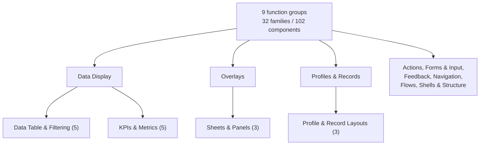
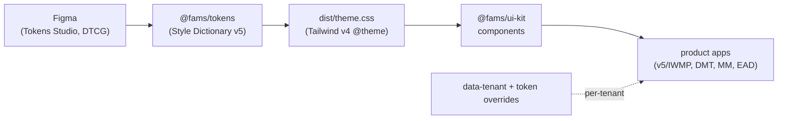

# FAMS Design System

Platform-wide, framework-agnostic design system for FAMS products (IWMP, DMT, MM, EAD, and beyond). One token source, one React component library, consumed by every product frontend — never forked.

This repo is self-contained: **architecture** is in `docs/ARCHITECTURE.md`, the **full library pick-list** (with licenses and rejected alternatives) is in `docs/LIBRARIES.md`, and **authoring rules** are in `CLAUDE.md`. A copy of the architecture and plans is also mirrored in Outline for the wider team (FAMS Design System space).

Full doc index, with recommended reading order: `docs/README.md`.

## Designer workspace setup (one time — no terminal needed)

Clone this repo and `fams-v5-demo-environment` side by side in one parent folder. Open Claude Code **in that parent folder** and paste exactly this:

> Set up my FAMS workspace (run fams-design-system/scripts/setup-workspace.sh)

Claude runs the setup itself: it links this repo's skills into the parent folder and writes a workspace CLAUDE.md. Then start a **new** Claude Code session in the same folder — the slash commands (`/figma-parity-loop`, `/new-component`, `/styling-change`, `/tenant-branding`, `/setup-workspace`) now autocomplete. Background: Claude Code only registers slash commands from the folder it is opened in, so skills living inside this repo need that one-time link at the workspace level.

## What's inside

Monorepo on pnpm workspaces + Turborepo.

| Package | Name | What |
| --- | --- | --- |
| `packages/tokens` | `@fams/tokens` | Design tokens (DTCG) → Style Dictionary v5 → CSS variables + Tailwind v4 `@theme`. Framework-agnostic source of truth; per-tenant overrides. |
| `packages/ui-kit` | `@fams/ui-kit` | React 19 components — shadcn/ui (Radix). **The product-agnostic core — every product consumes this; new tools use ONLY this.** |
| `packages/v5-templates` | `@fams/v5-templates` | **Tier 2 — v5-family patterns** (multi-tab profile drawer, v5 side-sheets, entity detail scaffolds). Opt-in compositions of `@fams/ui-kit`; other products never need it. See the 4-question cascade in `docs/BOUNDARIES.md`. |

| App | Port | What |
| --- | --- | --- |
| `workshop/showcase` | 6100 | **The** live component preview + docs platform, consuming the real `@fams/ui-kit`. The one place to see and read about **every** component. |
| `workshop/storybook` | 6400 | Storybook 10 (React + Vite) — an additive isolated-component workbench (controls, autodocs, a11y panel) on the real `@fams/ui-kit` + `@fams/tokens`. Intentionally a thin proof set of stories (Button/Input/KpiTile), not a catalogue. `pnpm --filter @fams/storybook dev`. |

> **React only.** All ~102 components live in `@fams/ui-kit`. Vue track removed; production Vue lives in the v5 repo as read-only reference. The `@fams/tokens` spine stays framework-agnostic so a future framework change stays cheap.

The showcase IA (`workshop/showcase`) organizes the ~102 components as 32 families in 9 function groups — each family a single page with member tabs. The grouping is grounded in v5-codebase usage research, not an arbitrary taxonomy:



## Architecture

Framework-agnostic **tokens** are the spine; **components** are built per framework on top of them:



Components use tokens via Tailwind utilities, never hardcoded values. Tenants differ only via `data-tenant` + token overrides — one component, no per-tenant forks. Packages are **versioned** (changesets, currently `0.9.x`); publishing to a self-hosted private registry (e.g. Verdaccio) is the intended distribution model (consume, don't fork; not a submodule, not registry-copy) — not yet wired. Full detail: `docs/ARCHITECTURE.md`.

## Tech stack (key libraries)

All MIT / Apache-2.0 / BSD. Full pick-list, licenses, and rejected alternatives in `docs/LIBRARIES.md`.

| Concern | Choice |
| --- | --- |
| Language / build | TypeScript strict · Vite 7 |
| Styling / tokens | Tailwind CSS v4 (`@theme`) · Style Dictionary v5 (DTCG) |
| Monorepo | pnpm + Turborepo |
| Primitives | shadcn/ui on Radix |
| Data grid / virtualization | TanStack Table v8 · TanStack Virtual |
| Server / client state | TanStack Query v5 · Zustand |
| Forms / validation | React Hook Form · Zod 4 |
| Maps | MapLibre GL v5 (`react-map-gl/maplibre`) · deck.gl · terra-draw |
| Charts | ECharts |
| Realtime / offline | SSE (`fetch-event-source`) · vite-plugin-pwa · Dexie |
| Dates / icons | date-fns v4 · Iconify + Lucide |
| Docs / test | `workshop/showcase` · Vitest + Testing Library |

## Prerequisites

- Node 20+
- pnpm 9+ (`corepack enable`)

## Getting started

```bash
pnpm install
pnpm --filter @fams/tokens build   # generate dist/tokens.css + dist/theme.css first
pnpm build                         # build all packages (Turborepo)
```

## Preview the component showcase locally

The showcase (`workshop/showcase`) is the live catalogue of every component — variants, states, props, guidelines. There is **no hosted preview**; run it locally:

```bash
pnpm install                       # once
pnpm --filter @fams/tokens build   # once (generates the CSS variables the components need)
pnpm --filter @fams/showcase dev
```

Open **http://localhost:6100**. Vite hot-reloads on save, so it always reflects your local code. Switch tenant theme and language (English / العربية, incl. RTL) from the top bar.

To view a production build locally instead:

```bash
pnpm --filter @fams/showcase build && pnpm --filter @fams/showcase preview
```

## Scripts (root, via Turborepo)

| Command | Runs |
| --- | --- |
| `pnpm build` | build every package |
| `pnpm test` | Vitest across all packages |
| `pnpm typecheck` | `tsc` across all packages |
| `pnpm lint` | lint across all packages, plus `lint:tokens` and the `llms.txt` staleness check |
| `pnpm build:registry` | regenerate `registry.json` + `packages/*/llms.txt` from `workshop/showcase/src/registry.tsx` + the package barrels |

## Agent enablement

For an AI agent working in this repo: start at the root `CLAUDE.md` (the constitution), then the relevant package's own `CLAUDE.md` (pointers + deltas only). `registry.json` (repo root) is a shadcn-shaped, read-only discovery index over `@fams/ui-kit` + `@fams/v5-templates`, generated by `pnpm build:registry` — NOT a copy-install source (this repo's distribution model rejects the shadcn registry-copy pattern, see `docs/BOUNDARIES.md` § Governance). Each package with a real export surface also has an `llms.txt` — a compact one-line-per-export index, kept fresh by `pnpm build:registry` (generated packages) or checked for missing mentions via `pnpm lint` (hand-authored packages).

## Adding a component

Authoring rules are in `CLAUDE.md` (the guardrail set). In short:

- Tokens are the single source of truth — never hardcode hex/px/font; use Tailwind utilities backed by `@fams/tokens`.
- Build on Radix primitives; accessibility is built-in (every interactive component passes axe).
- RTL-safe always — logical properties only (`ms-`/`me-`, `text-start`), never `ml-`/`text-left`.
- Boolean props `isLoading`/`isDisabled`/`hasError`; sizes `sm`/`md`/`lg`, never numeric.
- One component; tenants differ only via `data-tenant` + token overrides — no per-tenant forks.
- Every component ships with a test and a live demo in `workshop/showcase`; export it from `src/index.ts`.

## Theming / tenants

Tenants (Tadweer, EAD, FAMS, IWMP, MM) differ only through design tokens. Set `data-tenant="<tenant>"` on the app shell root; the matching token overrides in `packages/tokens/tokens/tenants/*.tokens.json` re-theme every component with no component changes.

## Distribution (plan, not yet wired)

Packages are **versioned** (changesets, `0.9.x`) but all `private: true` — there is no registry and no publish step yet. The intended model: publish to a **self-hosted private registry** (e.g. Verdaccio) as `@fams/ui-kit`, `@fams/tokens`, `@fams/v5-templates` — consume, don't fork. Product apps (e.g. v5-codebase) would add them as dependencies and update by version bump. Not distributed via the shadcn registry-copy model and not via git submodules. See `docs/ARCHITECTURE.md` §7 for the full rationale and the v5 integration path.

Until a registry exists, any consumer taking these packages as source (e.g. vendoring this repo into another workspace) must install them with `link:`, never `file:` — several packages carry workspace-only `catalog:` version refs that a `file:` install cannot resolve. Full detail (the exact error, why, and the cross-workspace React/router/query singleton requirement): `docs/PUBLISHING.md` §5.

## Reference

- `docs/README.md` — full docs index with recommended reading order
- `docs/ARCHITECTURE.md` — architecture, token pipeline, capability→library matrix, distribution
- `docs/BOUNDARIES.md` — DS-vs-application boundary rule, layer model, patterns & anti-patterns
- `docs/COMPONENT-GUIDE.md` — when to use which component (disambiguates look-alikes)
- `CLAUDE.md` — component authoring guardrails
- `docs/LIBRARIES.md` — canonical OSS library choices (full pick-list + licenses)
- `docs/ASSETS.md` — asset (icon/logo/font) naming and structure conventions
- `docs/USAGE-INDEX.md` — per-component map to the v5 pattern it replaces
- `CONTRIBUTING.md` — human contributor quick-start + PR checklist
- `docs/history/` — port-project working documents (provenance only)
