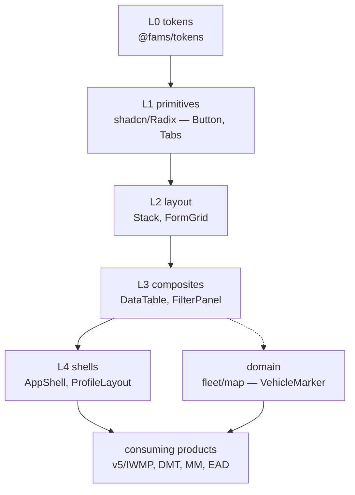

# FAMS Design System — Architecture

In-repo architecture record. **Current state: React is the primary track; Vue is kept as a reference/alternative. `@fams/tokens` is framework-agnostic and shared.** See `README.md` for the live repo structure and how to run it, and `docs/LIBRARIES.md` for the full library pick-list with licenses.

- **Date of record:** 2026-06-30 (framework-neutral design) · updated for React-primary
- **Scope:** a production-grade frontend layer for FAMS v5 products, consuming existing v5 APIs.

---

## 1. Why

The v5 frontend (Vue 3 + Quasar) is technically modern (844/859 SFCs use `<script setup>`) but architecturally incoherent: zero TypeScript, design tokens declared but not consumed, desktop-first (~11% of files responsive), per-tenant copy-paste (`FilterCard` ×4), ~37 components calling APIs directly. The design system fixes this at the root: a single, versioned, accessible, token-driven component library that every product consumes as a dependency.

## 2. Strategy

~70% of a frontend rebuild is framework-agnostic (tokens, API types, backend contract, monorepo, tests). Build that once; only component implementations differ per framework. React and Vue were built to equal depth as a fair comparison; **React is the chosen primary track**, with Vue retained as reference. Weighting was ecosystem + talent + migration cost — not AI code-generation quality (benchmarks show React ≈ Vue there).

## Scope — what the design system owns (and what it does not)

The design system is **presentation only**, and **state-agnostic / data-agnostic**. Components receive data and callbacks via props — they never fetch, never hold global state, never route.

| Design system owns | Consuming application (frontend rebuild) owns |
| --- | --- |
| Tokens, Tailwind theme | Routing, auth, app-shell wiring |
| Primitives (shadcn / Radix / Reka) | Server state + data fetching (TanStack Query) |
| Composites (DataTable, FilterPanel, MapPanel — *presentation*) | Client state store (Zustand / Pinia) |
| Component a11y, RTL, variants | Realtime transport (SSE), offline (Dexie / PWA) |
| Render-friendly component APIs | Mapping API responses → component props |

The capability→library matrix (§6) is the **platform** stack for context; only its presentation rows are the design system itself. State management, data fetching, realtime, and offline are the app layer — see the frontend-rebuild plans (Outline) for those.

## 3. Hard constraints (locked)

1. **Open-source + self-hostable + on-premise only.** No paid licenses, per-seat fees, or mandatory SaaS. All picks MIT/Apache/BSD. Rejected: AG Grid Enterprise, Highcharts, Dexie Cloud, Mapbox GL, SheetJS Pro, marker.js (Linkware), Fancybox (GPLv3).
2. **Single map engine = MapLibre GL.** Leaflet dropped. MapLibre scales to 100k+ where Leaflet's DOM markers die.
3. **Realtime = SSE push, not polling.** Polling is fallback only.
4. **Lean by default.** Native/agnostic-first; add heavy libs only where genuinely needed.
5. **TypeScript strict everywhere.**

## 4. Token pipeline (the spine)

```
Figma (Tokens Studio, DTCG export)
   → packages/tokens/tokens/core.tokens.json  (+ tenants/<tenant>.tokens.json)
   → Style Dictionary v5 (style-dictionary.config.js)
   → dist/tokens.css        (:root CSS variables, prefix --fams-*)
   → dist/theme.css         (Tailwind v4 @theme block: --color-*, --radius-*, --spacing-*,
                              --font-*, --text-*, --leading-*, --shadow-*, --breakpoint-*,
                              --icon-*, --duration-*, --ease-*, --z-*)
   → dist/tenants.css       ([data-tenant='<tenant>'] blocks — runtime semantic color overrides)
   → dist/theme.echarts.json (ECharts theme object — categorical + heat ramps, for ChartContainer)
   → components use Tailwind utilities (bg-primary, rounded-md, …) — never hardcoded values
```

### Shipped utilities — one compile, one cascade (decided 2026-09-08)

Consumers get our `dist`, so their Tailwind cannot see our class names; the DS ships the utilities instead. There is **exactly one** Tailwind compile for the whole repo: `packages/tokens/utilities.build.css` `@source`s every markup package's `src` (`ui-kit`, `v5-templates`, `v5-composer`, `demo-kit`) and `scripts/build-css.mjs` emits `packages/tokens/dist/utilities.css` → `@fams/tokens/utilities.css`. Each markup package's build then copies that byte-identical file into `dist/fams-<pkg>.css` for its own `./utilities.css` export (`scripts/copy-utilities.mjs`), so installing a single package from a registry still works.

**Why not one compile per package** (what shipped in c004a6c and was reverted here): Tailwind guarantees a variant comes after the base utility it overrides (`md:flex` after `flex`) only *within a single compile*. Four compiles each emitted their own unconditional base utilities, and the consumer concatenated them into one `utilities` cascade layer — where equal-specificity ties resolve by import order, so a later package's plain `.hidden`/`.flex` beat an earlier package's `md:`/`lg:` variant. Responsive layouts (LoginPage's desktop split, `AppShell`/`TopNav`'s `hidden md:flex` sidebar) silently collapsed, and the only local fix was `!important`. One compile makes the cascade deterministic; the `!` band-aids were removed as proof.

**Consumers import `@fams/tokens/utilities.css` once**, after the token/theme imports. The per-package `./utilities.css` paths remain valid and, being identical content, cannot reorder into a broken state. Never tell a consumer to `@source` our `src/` — that ties them to a sibling checkout. A new markup package adds its `@source` line to `packages/tokens/utilities.build.css`.

Tokens are framework-agnostic and permanent — they survive any framework change. A new visual value is a new token, not an inline value. `--duration-*` / `--ease-*` (motion) and `--z-dropdown` … `--z-tooltip` (the semantic stacking scale) are token families, not ad-hoc values — see `CLAUDE.md`'s authoring rules.

## 5. Tiers

Five layers, matching `src/{primitives,layout,composites,shells,domain}` 1:1. Full boundary rule, patterns, and anti-patterns per layer: `docs/BOUNDARIES.md`.



`domain/` (e.g. the fleet `map/*` widgets) sits alongside L1–L4, not below them — a deliberate, narrow exception per Rule 10 (no business vocabulary in shared props) because fleet is FAMS's product domain. Composition (tab manifests, column sets) is app data — consuming products import any layer, never fork it.

Rule: `ui-kit` is the only tier-1 package; higher tiers (`v5-templates`, consuming products) never reach into tier 1's internals. The only shared layer is `@fams/tokens` (and pure TS utils).

### The three-tier package model (added 2026-07-06)

Above the L0–L4 layers sits a **package-level** tiering (the "Carbon model" — cf. `@carbon/react` + `@carbon/ibm-products`), so the core stays strictly product-agnostic while v5-family products get their signature patterns without forking:

```
tier 1  @fams/tokens + @fams/ui-kit   product-agnostic core — every product; new tools use ONLY this
tier 2  @fams/v5-templates               v5-family compositions (multi-tab profile drawer, v5 side-sheets,
                                        entity detail scaffolds) — opt-in; composes tier 1, never forked from it
tier 3  product repos                   manifests, data wiring, feature screens
```

Dependency direction is absolute (`v5-templates → ui-kit → tokens`; never reverse). Business vocabulary: banned in tier 1, allowed in tier 2. Same quality gates everywhere. Membership is decided by the 4-question cascade in `docs/BOUNDARIES.md`.

## Rendering performance & the state boundary

Most render performance is won or lost in the **application** layer (store selectors, query-cache granularity, avoiding re-render storms) — that is the frontend rebuild's concern, not the design system's. But the DS must not obstruct it. DS responsibilities:

- **Pure presenters.** Data + callbacks in via props; no internal global state, no data fetching. The API-response → props mapping lives in the app's container/feature layer (container/presenter split), never inside a DS component.
- **Memoizable.** Stable prop contracts; a component must not create new object/array/function identities that bust a consumer's memoization.
- **Virtualization built in** for data-heavy components (DataTable, long lists) — never render 60k rows.
- **Patch, don't re-render, for high-frequency data.** The map component updates via layer `setData`, not a React re-render per GPS tick.
- **Intent: profiled hot paths.** DataTable and MapPanel should ship render-optimized — an automated perf check is not yet wired; this is a review-time concern for now.

## 6. Capability → library matrix (IWMP-grounded)

Every pick is MIT/Apache/BSD. Full pick-list with licenses and rejected alternatives is in `docs/LIBRARIES.md`.

| Capability | Requirement | React | Vue (reference) | Notes |
| --- | --- | --- | --- | --- |
| Map engine | 15k vehicles + 60k bins | `react-map-gl/maplibre` v8 | `@indoorequal/vue-maplibre-gl` v8 | MapLibre v5 (BSD); Leaflet dropped |
| Clustering | 60k bins | MapLibre native → deck.gl >50k | same | deck.gl MIT for 100k+ |
| Geozone draw | polygon→GeoJSON | terra-draw / `maplibre-gl-terradraw` | same | mapbox-gl-draw rejected (dead) |
| Data grid | 60k–100k rows, grouping, saved views | TanStack Table v8 + Virtual + shadcn DataTable | same | MIT; AG Grid Enterprise rejected (paid) |
| Charts | ~15 dashboards | ECharts (thin `echarts.init` wrapper) | vue-echarts | Apache-2.0; Highcharts rejected |
| Realtime | 15k vehicles live | SSE (`@microsoft/fetch-event-source`) / polling day 1 → `setQueryData` | SSE via VueUse `useEventSource` | not WebSocket |
| Offline / PWA | field resilience | vite-plugin-pwa + TanStack persist + Dexie | same | Dexie Cloud rejected (SaaS) |
| Exports | Excel/PDF/PNG | ExcelJS + jsPDF/pdfmake + modern-screenshot | same | SheetJS + html2canvas rejected |
| Forms | validation | RHF + Zod 4 | VeeValidate + Zod 4 | TanStack Form escape hatch |
| Server/client state | cache + local | TanStack Query v5 + Zustand 5 | TanStack Query v5 / Pinia | — |
| Dates | timestamps | date-fns v4 + @date-fns/tz | same | moment dropped |
| Icons | tenant + base | Iconify engine + Lucide + per-tenant sets | same | per-set license allow-list + CI check |

### Realtime verdict

For one-way GPS push at scale, **SSE over HTTP/2 + HTTP POST for commands** beats WebSocket (~10× lighter server state, built-in reconnect + `Last-Event-ID` recovery, no sticky sessions, reuses Express). Built transport-agnostic so day-1 polling flips to SSE invisibly.

### Data grid

"Just a table" (grouping, pin/resize/reorder, 100k virtualization, server-side data, saved views) is fully OSS-achievable: TanStack Table v8 (headless) + TanStack Virtual + shadcn DataTable shell — identical both frameworks, MIT, fully owned. Never a paid grid.

## 7. Distribution — consume, don't fork (wired and dormant; registry not yet chosen)

Packages are **versioned** (changesets; currently `0.9.0` across all seven library packages). As of 2026-08-05 the **publish flow is built and tested but deliberately dormant** — full detail and the human runbook are in [`docs/PUBLISHING.md`](PUBLISHING.md). In short:

- The seven library packages (`@fams/tokens`, `ui-kit`, `skeleton-kit`, `demo-kit`, `v5-composer`, `v5-templates`, `v5-kit`) are **no longer `private: true`**: they carry `publishConfig.access = "restricted"`, a `license`, and a `prepublishOnly` guard. The four workshop/preview packages (root, `@fams/showcase`, `@fams/storybook`, `@fams/skeleton-example`) stay **private forever** — they are apps, not distributables.
- The registry is chosen by **one registry-agnostic switch**, the `FAMS_NPM_REGISTRY` env var (repository *variable* in CI) plus a `FAMS_NPM_TOKEN` secret. **No vendor is hardcoded anywhere.** With the switch unset — today's state — `pnpm release` no-ops loudly, the `prepublishOnly` guard blocks any stray `npm`/`pnpm publish`, and `.github/workflows/release.yml` fails its preflight with an explicit instruction. The required `ci.yml` gate is untouched.
- Correctness of the published shape is gated by `pnpm smoke:pack` — `pnpm pack` all seven, then install and import them in a consumer **outside this repo**, covering every `exports` entry point (including `@fams/v5-templates/map`).
- **Still open (human, not mechanical):** which registry, the credential, the first real publish, the first version number, whether release tags get pushed, and flipping `fams-v5-demo-environment` off `link:`.

The intended distribution model remains: publish to a **self-hosted private registry** (e.g. Verdaccio — MIT, offline-capable) or another free/entitled host, with products (e.g. v5-codebase) declaring `@fams/ui-kit` + `@fams/tokens` as dependencies and updating by version bump.

Deliberately rejected: the shadcn registry-copy model (every consumer forks → drift, no fix propagation) and git submodules (pin a commit, invite forking). Once a registry is live: the v5 React layer adds the packages as dependencies, imports the tokens stylesheet, sets `data-tenant` on the shell root. No source copied; nothing forked. Until then, this repo plus a sibling `link:` checkout (`fams-v5-demo-environment`) is the only place the components run — and `fams-v5-demo-environment`'s `tools/ds-consumption.mjs` already provides the one-step flip onto pinned versions.

## 8. Tenancy

One component; tenants (Tadweer, EAD, FAMS, IWMP, MM) differ only via `data-tenant="<tenant>"` on the shell root + per-tenant token override files (`packages/tokens/tokens/tenants/*.tokens.json`). Logos/brand surface through `<Logo/>` / `<Icon/>` config, never hardcoded. No per-tenant component forks.

## 9. Cross-cutting

- **Testing:** Vitest + Testing Library per component. Playwright visual regression harness exists (`workshop/showcase/e2e/visual.spec.ts`, run via `pnpm --filter @fams/showcase test:visual`) but is **not yet a CI gate** — baselines are OS-specific and gitignored until Linux baselines are generated on the CI OS (see `workshop/showcase/.gitignore`). Actual CI order (`.github/workflows/ci.yml`): install → build tokens → typecheck → lint → test → build — no e2e step. `workshop/showcase` is the **primary** live-preview surface, consuming the real published components (never re-implemented locally). **Storybook 10** was installed 2026-08-05 (founder call) as the additive sibling package `workshop/storybook` — an isolated prop-level workbench with a deliberately thin proof set of stories; its `storybook build` is **not** in the required gate (optional `.github/workflows/storybook.yml` lane), and it does not feed the registry-derived visual-regression suites.
- **RTL (Arabic, non-negotiable):** `dir="rtl"`, Tailwind v4 logical properties only, Radix/Reka direction provider.
- **a11y:** built on Radix/Reka primitives; enforced via `eslint-plugin-jsx-a11y` (real CI gate) + manual verification in `workshop/showcase` + Playwright axe once wired. Target WCAG 2.2 AA.
- **Responsive:** Tailwind mobile-first + `@container`.
- **PWA/offline:** structure for offline-first, ship offline-read first; all mutations route through one layer so an offline write-queue drops in later.

## 10. Risks

- shadcn-vue + Reka UI are one community org (`unovue`) — bus-factor (mitigated by owning copied-in source; and Vue is now reference-only).
- MapLibre v6 is pre-release — stay on v5.
- Figma Variables REST API is Enterprise-only — Tokens Studio is the system of record regardless.
- DTCG 2025.10 is a stable CG spec, not a ratified W3C standard.
