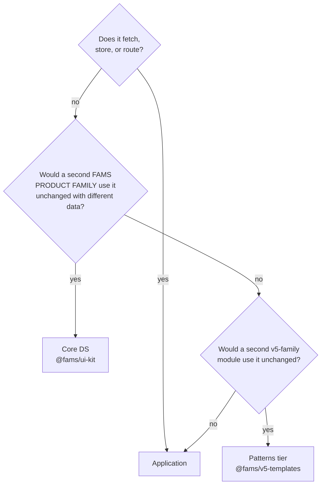

# FAMS Design System — Boundaries, Patterns & Anti-patterns

> Constitution: see docs/knowledge-base/ — locked decisions, naming, architecture, tech stack.

What belongs in the design system vs the consuming application, decided by rule — not by component list. This doc is the reference for that decision, with real cases per layer. Evidence lines reference the v5-codebase audit of 2026-07-02 (494 package components analysed).

---

## The rule

> **The design system owns every decision that should not be re-made per developer.
> The application owns every decision that legitimately varies per feature.**

The gap between two form fields is not a feature decision — no client ever asked for 12px vs 16px — so the system owns it. Which tabs a Compactor profile shows *is* a feature decision — so the app owns it, as config.

## The 4-question cascade

Run these in order for any component candidate. (Extended 2026-07-06 from the original 3-question test when the **patterns tier** was added — see § The patterns tier below.)

1. **Does it fetch, store, or route?** → Application. (Hard rule 8 — state-agnostic presenters.)
2. **Would a second FAMS *product family* use it unchanged if handed different data?** → Core design system (`@fams/ui-kit`).
3. **Would a second *v5-family* module/product use it unchanged?** → Patterns tier (`@fams/v5-templates`).
4. **Otherwise** → Application code. (The rule of three may promote it later.)

Within the core, the old question 3 still applies: *is it a visual or behavioral decision a developer would otherwise make ad-hoc?* → core.



The boundary often runs *through* a component, not between components: the Combobox presenter is DS; the entity fetcher feeding it is app. Split there, always.

---

## The layers

Five DS layers, four app layers. A component's layer determines its folder, its prop vocabulary, and what it is allowed to know.

```
DESIGN SYSTEM                          APPLICATION
L0  tokens        (vocabulary)         hooks       (fetch, debounce, cache)
L1  primitives    (parts)              containers  (which API, auth, wiring)
L2  layout        (grammar)            manifests   (composition as data)
L3  composites    (behavior)           domain UI   (feature panel bodies)
L4  shells        (page archetypes)
```

### L0 — Tokens

The vocabulary: color, type, radius, shadow, **and semantic spacing**. A raw scale (`spacing.4 = 16px`) is necessary but not sufficient — the scale answers "which values exist", semantic tokens answer "which value goes where", which is the question developers actually face.

**Cases**
- `space-field-gap` (16px) — vertical gap between form fields. `space-section-gap` (24px) — between form sections. `space-inline-gap` (8px) — icon-to-label, chip-to-chip. A handful of semantic tokens, not thirty.
- Status colors as tokens (`color-status-positive`), consumed via utilities — never re-declared.

**Pattern:** a new visual value = a new token, reviewed once.
**Anti-pattern:** re-hardcoding a token's value at point of use. *Evidence: v5 `AssetVehicleProfile.vue` re-hardcodes `#12B76A` in scoped styles while the same green exists as `$positive`; token vars pasted into inline styles and SVG strings across charts/filters.*

### L1 — Primitives

Single-purpose interactive parts on Radix: Button, Input, Select, Checkbox, Switch, Textarea, Label, **Tabs**, Dialog, Popover, Tooltip.

**Cases**
- **Tabs IS a primitive** — strip, active state, keyboard nav, RTL. *Evidence for why: v5 has raw `q-tabs` in 45 files; one profile file contains ~24 inline `<q-tab>` AND a second parallel tab mechanism (`v-show` blocks) in the same 781-line component.*
- Button variants via cva; sizes `sm|md|lg`, never numeric.

**Pattern:** one canonical primitive per interaction concept; variants via `variant`/`size` props matching Figma names.
**Anti-pattern:** reaching past the DS to the underlying library (raw Radix/Quasar) in feature code — that's how 45 hand-rolled tab strips happen.

### L2 — Layout

The grammar for composing parts: **Stack, FormGrid, FormSection, Toolbar**. This layer exists so that **developers never write spacing**. They pick a layout component; the component owns the gap; the gap prop accepts only semantic presets (`gap="field" | "section" | "inline"`), never numbers.

**Cases**
- Five inputs in a form → `<FormGrid columns={2}>` or `<Stack gap="field">`. The developer makes zero spacing decisions.
- A settings page → `<Stack gap="section">` of `<FormSection title>` blocks; each section internally uses `gap="field"`.
- Button row in a dialog footer → `<Toolbar justify="end">` — gap and alignment preset.

**Pattern:** spacing between DS components comes exclusively from layout primitives; spacing inside DS components comes from tokens.
**Anti-pattern:** per-developer margins. *Evidence: v5 has 4,653 scattered spacing utility classes PLUS 2,468 inline `style` attributes (602 with literal margin/padding) — `margin-top: 40px` magic pixels next to `q-mb-sm` in the same template. A spacing scale existed; nothing forced it. Presets without a layout layer do not work.*

### L3 — Behavioral composites

Components that encode **functionality, not just styling**: Combobox, DataTable, FilterPanel, ColumnCustomizer, Card, ListRow, plus the state-display set (Skeleton, StatusView, NoPermission).

Behavior guarantees live here, and they are enforced structurally: you don't write a guideline "dropdowns should have search" — you ship **one Combobox where search is built-in and there is nothing else to reach for**.

**Cases**
- **Combobox** — search, debounce display, loading/no-results/max-reached states, single/multi chips, keyboard nav: all baked in. Data via props; fetching stays in an app hook. *Evidence for why: v5 has ~20 forked entity-pickers (EntityLinkingDrawer exists 3×, two copies byte-identical; LotSectorSelector has a V2 fork of itself), each re-implementing search + async + display columns.*
- **DataTable** — sorts data it was *given*, in memory; server-side sort/pagination belongs to the caller. Controlled or uncontrolled, never fetching.
- **StatusView (`kind: 'empty' | 'error' | 'no-permission'`) / NoPermission** — every data surface renders all its states; features get them for free.

**Pattern — the three variation axes.** When uses differ, identify which axis varies:
1. **Behavior varies** → props (`multiple`, `minChars`, `filterLocally`, `maxSelected`).
2. **Content varies** (simple label vs avatar + plate + status row) → render slot (`renderOption`). DS owns list mechanics; caller owns row content when domain-specific.
3. **Data varies** → not the component's business. App hook (`useEntityPicker`) feeds `options` + `loading` in.

**Anti-pattern:** per-use-case boolean flags (`isVehiclePicker`, `showLongVersion`). Flag proliferation is how DS components die — it moves feature knowledge into the DS and makes every change a breaking change.
**Anti-pattern:** the composite fetching its own data. *Evidence: ~60% of v5's 805 components are data-coupled at the leaf; that coupling is why none of them could be shared.*

### L4 — Shells (page archetypes)

Page-level skeletons with **slots and zero content**: AppShell, ListView, HybridView (map + panel), PageHeader, **ProfileLayout**, WizardLayout. A shell owns chrome, drawer behavior, responsive stacking, panel resizing — never what goes inside.

**Cases**
- **ProfileLayout** — header + tab strip + panel canvas + drawer mechanics. Which tabs exist for `AssetVehicle` on tenant iwmp, in which order, behind which privilege = a **manifest** (data) in the app, feeding the one shell. *Evidence for why: v5 hand-rolls 31 profile components across 3 tenant packages; `fams` and `ead` copies are byte-identical (diff = 0) yet both diverged from `iwmp` — composition encoded as copied code instead of config.*
- **HybridView** — splitter, panel collapse/resize states; the map and the panel content are slots. (v5 signature archetype: 79 map+panel files.)

**Pattern:** shells own chrome; slots own content; composition is app data (manifest), not DS code.
**Anti-pattern:** a shell with domain opinions (a ProfileLayout that knows about bins) — it becomes a fork magnet the moment a second entity needs it.

### The patterns tier — `@fams/v5-templates` (between DS and app)

Added 2026-07-06, on the Head-of-Design's question: *v5 has its own patterns (asset profile, task detail, multi-tab side-sheets) — many v5 products need them, other tools must not inherit them.* Industry precedent: the **Carbon model** — IBM ships `@carbon/react` (product-agnostic core) and `@carbon/ibm-products` (product-family patterns) as separate packages.

- **What lives here:** v5-signature *compositions* of core components — the multi-tab pinned profile drawer, the v5 side-sheet behavior, asset/task detail scaffolds. Question 3 of the cascade decides membership.
- **Laws:** dependency direction is absolute (`v5-templates → ui-kit → tokens`; the core never imports patterns and must build without them). Patterns **compose, never fork** — needing to fork a core component means the core has an API gap, fixed in core. **Business vocabulary is allowed here** (`AssetProfileShell` is a fine name) and stays banned in the core. **Same quality gates** as the core: tokens-only, RTL, axe per component, API grammar.
- **Promotion/demotion stays alive across the tier:** a pattern adopted by a second product family is generalized and promoted to core; a core component that turns out product-specific is demoted here; a pattern used by one module only is demoted to app code.
- The fleet `domain/map` set stays in the core for now — fleet is FAMS's domain across *all* product families, so it passes question 2. Revisit if a non-fleet product family joins.

### Application layers (for contrast — what the DS must never absorb)

- **Hooks** — `useEntityPicker({ fetcher, mapItem })`: debounce, cancellation, cache, pagination. One hook + N fetchers replaces N forked pickers.
- **Containers** — which API, auth context, routing glue; maps API responses → component props.
- **Manifests** — tab sets, column sets, filter definitions per entity/tenant. Tenant differences are **brand → tokens; composition/business rules → manifests + hooks. Never a component fork.**
- **Domain UI** — the body of the bin-collection tab panel. Lives with the feature.

---

## Scenario coverage — harvest, don't enumerate

Do not attempt an a-priori scenario matrix; it overcomplicates the DS and still misses reality. The platform already ran the experiment — existing product screens ARE the requirements document (v5: 8 page archetypes cover essentially every screen; the ~20 picker forks enumerate exactly which Combobox props are needed, because each fork exists to express one axis of variation).

**Promotion path (rule of three):**
1. Component is born in feature code. Stays there.
2. Needed a second time → shared app-level component. Watch it.
3. Needed a third time, or by a second product → **promote to DS**, generalizing only the variation the three real uses demonstrated.

The DS stays small because everything in it earned its place. The promotion path is also the living connection between the app repos and this one: app-layer components are the DS's farm team.

## Governance

- **`workshop/showcase` is the contract.** If a state isn't demoed there, it doesn't exist. Variant names match Figma names.
- **No business vocabulary in shared component props** — `options`, `columns`, `renderOption`; never `vehicleType`. (Deliberate exception: the fleet-domain widget set (`map/Vehicle*`) — fleet is FAMS's product domain.)
- **Deprecate, don't break.** SemVer; deprecated aliases kept one minor cycle.
- **Distribution: consume, don't fork.** Versioned private npm package. The shadcn registry-copy model is rejected — it is institutionalized forking.

## Success metric

A developer builds a new screen **without making a single visual decision**. Every choice they would otherwise improvise — a gap, a tab style, a dropdown behavior — has exactly one obvious answer in this system.
